# vikit-learn

Vikit-learn is a computer vision processing toolkit developed using Python, based on deep learning technology.

This package aims to provide a series of easy-to-use tools that can handle real-world tasks.

The project is still under active construction and development, so please look forward to this work!

## Installation

### Dependencies

- Python>=3.10
- matplotlib>=3.7.5
- torch>=2.1.2
- torchvision>=0.16.2
- torchmetrics>=1.3.2
- lightning-utilities>=0.11.2
- faster-coco-eval>=1.5.4
- pycocotools>=2.0.7

### With pip

```bash
pip install git+https://github.com/bxt-kk/vikit-learn.git
```

## Usage

### Training model

```python
# Import `pytorch` and `vklearn`
import torch
from torch.utils.data import DataLoader
from vklearn.trainer.trainer import Trainer
from vklearn.trainer.tasks import Detection
from vklearn.models.trimnetx import TrimNetX as TRBNetX
from vklearn.datasets.oxford_iiit_pet import OxfordIIITPet


device = torch.device('cuda:0')
# Create model TrbnetX
model = TRBNetX(
    num_classes=2,
    anchors=[(a, a) for a in [21, 63, 189]],
)

# Get default transforms from TRBNetX
train_transforms, test_transforms = model.get_transforms()

# Create datasets
dataset_root = '???/OxfordIIITPet'
dataset_type = 'detection'
train_data = OxfordIIITPet(
    dataset_root,
    split='trainval',
    target_types=dataset_type,
    transforms=train_transforms)
test_data = OxfordIIITPet(
    dataset_root,
    split='trainval',
    target_types=dataset_type,
    transforms=test_transforms)

# Create DataLoader
batch_size = 16

train_loader = DataLoader(
    train_data, batch_size, shuffle=True, collate_fn=model.collate_fn, num_workers=4)
test_loader = DataLoader(
    test_data, batch_size, shuffle=True, collate_fn=model.collate_fn, num_workers=4)

# Build object detection task
task = Detection(
    model, device,
    loss_options={'weights': dict(conf=0.5, bbox=1.5, clss=0.5)},
)

# Build a trainer by specifying the training task and setting up trainer parameters
trainer = Trainer(
    task,
    output='/tmp/catdog',
    checkpoint=None,
    train_loader=train_loader,
    test_loader=test_loader,
    epochs=5,
    lr=1e-3,
    show_step=50,
    save_epoch=5)

# Initialize the trainer, then perform training.
trainer.initialize()
trainer.fit()
```

Upon training completion, there will be visualization images of model training results in the `/tmp/logs/` directory:

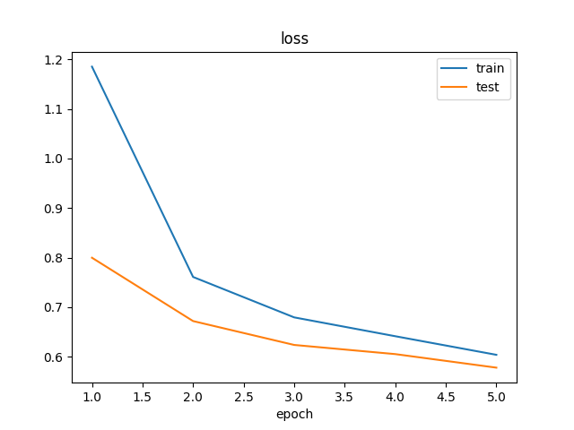
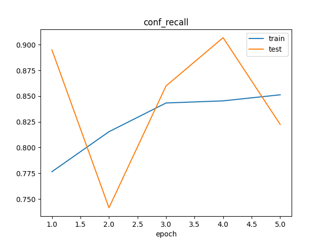
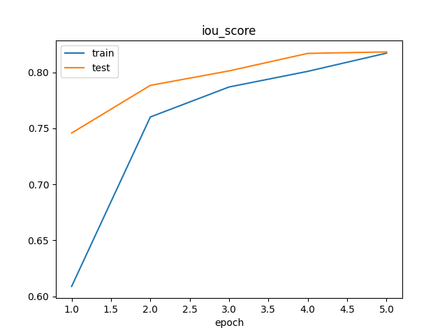
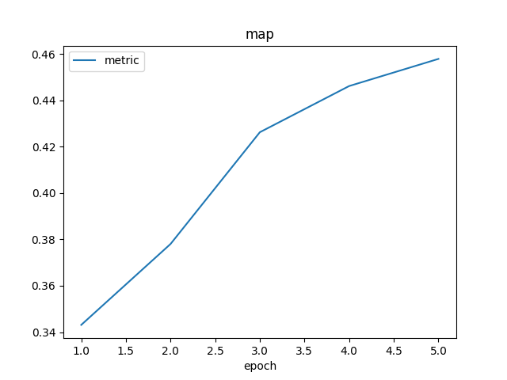
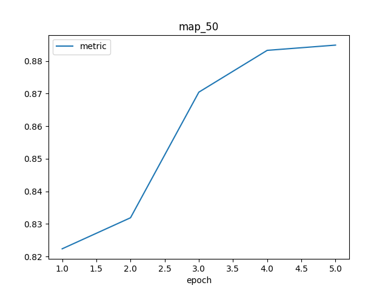


## Using model

We can call the trained model for object detection in the following way:

```python
# Import `pytorch` and `vklearn`
import torch
from vklearn.models.trimnetx import TrimNetX


device = torch.device('cpu')
# Load model from state object
state = torch.load('logs/catdog-4.pt', map_location='cpu')
model:TrimNetX = TrimNetX.load_from_state(state)
model.eval().to(device)

import matplotlib.pyplot as plt
from PIL import Image
from glob import glob

img = Image.open('???/cat.jpeg')
# Detect and display results
with torch.no_grad():
    objs = model.detect(img, iou_thresh=0.5, conf_thresh=0.7)
print(len(objs), objs)
fig, ax = plt.subplots()
ax.imshow(img)
for obj in objs:
    print('label:', obj['label'])
    # if obj['label'] != 0: continue
    x1, y1, x2, y2 = obj['box']
    ax.add_patch(plt.Rectangle((x1, y1), x2 - x1, y2 - y1, color='yellow', fill=False))
plt.show()
```

Here are some examples:

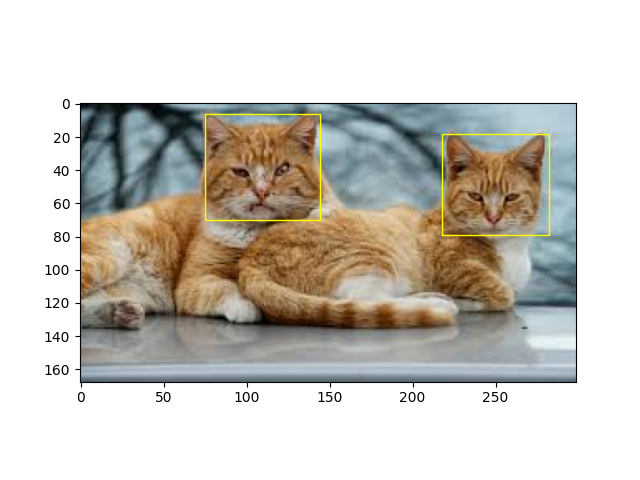
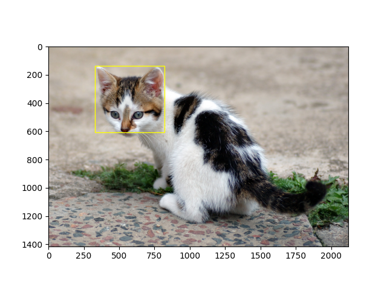

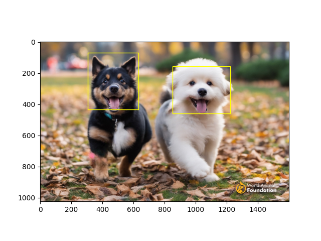
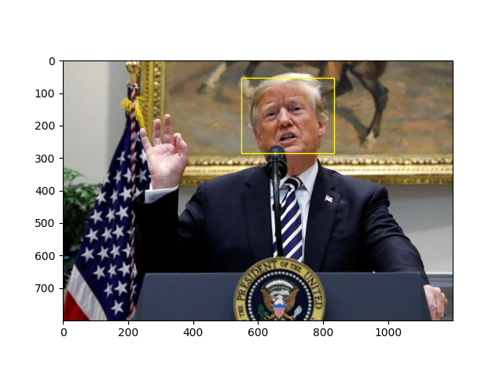
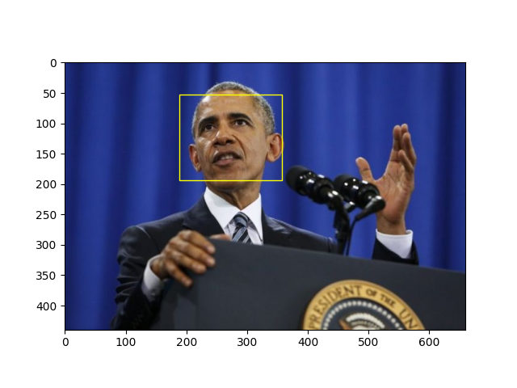
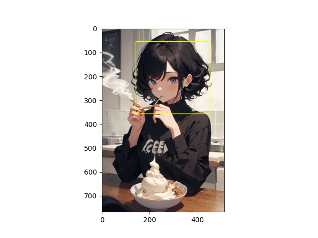
