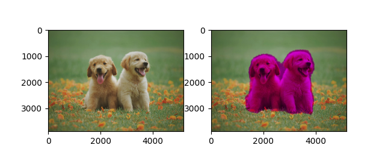
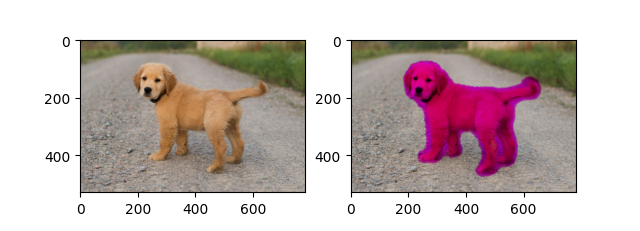
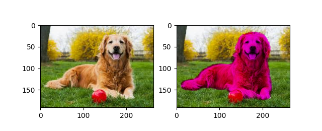
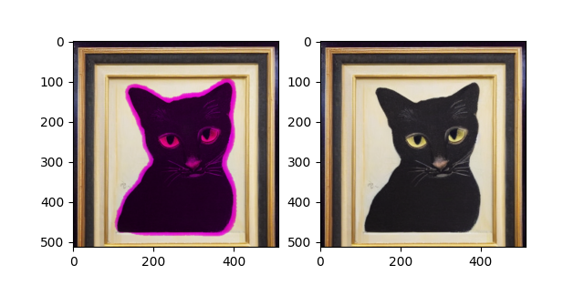
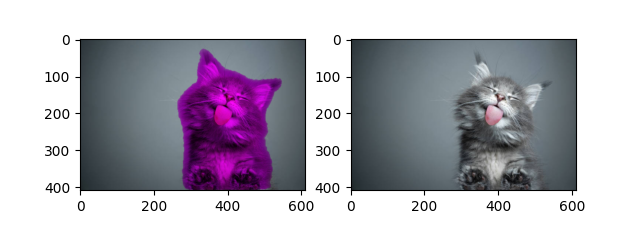
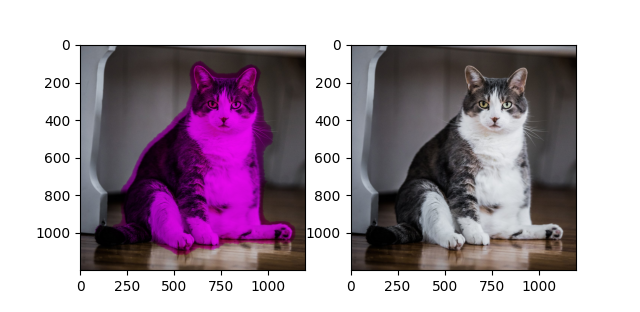

# vikit-learn

Vikit-learn is a computer vision processing toolkit developed using Python, based on deep learning technology.

This package aims to provide a series of easy-to-use tools that can handle real-world tasks.

The project is still under active construction and development, so please look forward to this work!

Current Support: Image Classification, Object Detection, Semantic Segmentation, Keypoint&Joint Detection 

## Installation

### Dependencies

- matplotlib>=3.7.5
- torch>=2.1.2
- torchvision>=0.16.2
- torchmetrics>=1.4.0
- lightning-utilities>=0.11.2
- faster-coco-eval>=1.5.4
- pycocotools>=2.0.7
- clip @ git+https://github.com/openai/CLIP.git
- opencv-python>=4.10.0

### With pip

```bash
pip install git+https://github.com/bxt-kk/vikit-learn.git
```

## Usage

### Training model

```python
# Import `pytorch` and `vklearn`
import torch
from torch.utils.data import DataLoader

from vklearn.trainer.trainer import Trainer
from vklearn.trainer.tasks import Detection
from vklearn.models.trimnetdet import TrimNetDet as Model
from vklearn.datasets.oxford_iiit_pet import OxfordIIITPet


dataset_root = '/kaggle/working/OxfordIIITPet'
dataset_type = 'detection'
device       = torch.device('cuda' if torch.cuda.is_available() else 'cpu')
batch_size   = 16
lr           = 1e-3
lrf          = 0.2

# Get default transforms from TRBNetX
train_transforms, test_transforms = Model.get_transforms('cocox448')

# Create datasets
train_data = OxfordIIITPet(
    dataset_root,
    split='trainval',
    target_types=dataset_type,
    transforms=train_transforms)
test_data = OxfordIIITPet(
    dataset_root,
    split='trainval',
    target_types=dataset_type,
    transforms=test_transforms)

# Create model TrbnetX
model = Model(
    categories=train_data.bin_classes,
)

# Create DataLoader
train_loader = DataLoader(
    train_data, batch_size,
    shuffle=True,
    drop_last=True,
    collate_fn=model.collate_fn,
    num_workers=4)
test_loader = DataLoader(
    test_data, batch_size,
    shuffle=False,
    drop_last=True,
    collate_fn=model.collate_fn,
    num_workers=4)

print(len(train_loader))

# Build object detection task
task = Detection(
    model, device, metric_options={'conf_thresh': 0.05},
)

# Build a trainer by specifying the training task and setting up trainer parameters
trainer = Trainer(
    task,
    output='/kaggle/working/catdog',
    checkpoint=None,
    train_loader=train_loader,
    test_loader=test_loader,
    epochs=10,
    lr=lr,
    lrf=lrf,
    show_step=50,
    drop_optim=True,
    drop_lr_scheduler=True,
    save_epoch=5)

# Initialize the trainer, then perform training.
trainer.initialize()
trainer.fit()
```

Upon training completion, there will be visualization images of model training results in the `/kaggle/working/logs/` directory:


Based on the focal-boost loss function I designed, the model can be successfully trained on tasks with extremely low positive sample ratio.

## Using model

We can call the trained model for object detection in the following way:

```python
# Import `vklearn`
from vklearn.models.trimnetdet import TrimNetDet as Model
from vklearn.pipelines.detector import Detector as Pipeline


pipeline = Pipeline.load_from_state(Model, '/kaggle/working/catdog-best.pt')

import matplotlib.pyplot as plt
from PIL import Image

img = Image.open('??YOUR IMAGE PATH??')
# Detect and display results
objs = pipeline(img, align_size=448)
print(len(objs), objs)
fig = plt.figure()
pipeline.plot_result(img, objs, fig)
plt.show()
```

Here are some examples:


Here are some examples of image classification: 


Here are some examples of semantic segmentation: 








Here are some objectives that support directional localization, which is implemented based on keypoint&joint detection technology:


