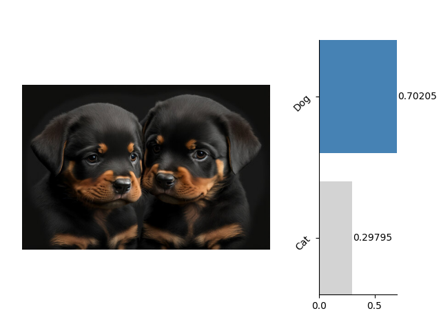
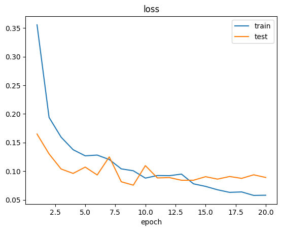
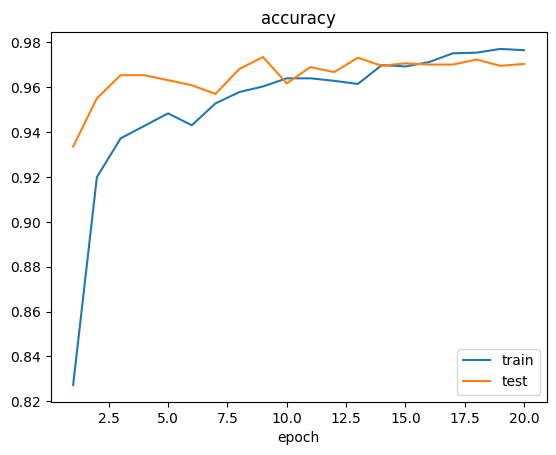
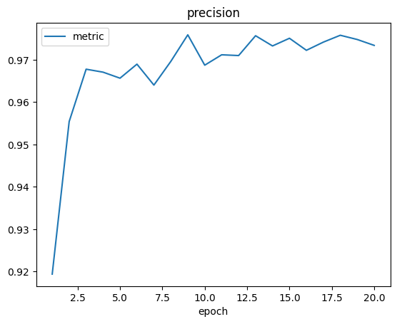
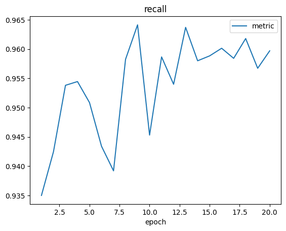
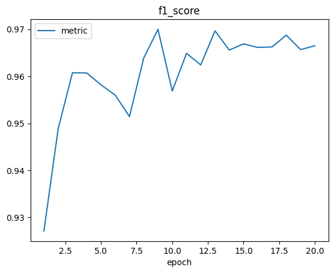

# vikit-learn・Classification

In this tutorial, we'll learn how to train an image classifier using `vikit-learn`. We'll be using the OxfordIIITPet dataset, which contains images of cats and dogs, for this practical example.



## Installing the `vikit-learn` Tool

We can use `pip` to download and install `vikit-learn` directly from GitHub:

```bash
pip install git+https://github.com/bxt-kk/vikit-learn.git
```

---

## Writing the Training Script

We need to write some script code to train our model.

### 1. Import the necessary packages from `vikit-learn` and `pytorch`

```python
import torch
from torch.utils.data import DataLoader

from vklearn.trainer.trainer import Trainer
from vklearn.trainer.tasks import Classification as Task
from vklearn.models.trimnetclf import TrimNetClf as Model
from vklearn.datasets.oxford_iiit_pet import OxfordIIITPet
```

- `Trainer`: A general training tool used to set training parameters and execute the training process.
- `Classification`: Specifies the training parameters related to the classification task.
- `TrimNetClf`: A built-in classifier model in `vikit-learn`.
- `OxfordIIITPet`: A built-in dataset tool in `vikit-learn`.

### 2. Prepare the Training Data

```python
dataset_root = '/kaggle/working/OxfordIIITPet'
dataset_type = 'binary-category'

train_transforms, test_transforms = Model.get_transforms()

train_data = OxfordIIITPet(
    dataset_root,
    split='trainval',
    target_types=dataset_type,
	download=False,
    transforms=train_transforms)
test_data = OxfordIIITPet(
    dataset_root,
    split='test',
    target_types=dataset_type,
    transforms=test_transforms)
```

First, we need to specify the location of the data with `dataset_root`. Then, we specify the type of data with `dataset_type = 'binary-category'`, which means binary classification data for cats and dogs. Additionally, we split the data into a training set (`split='trainval'`) and a test set (`split='test'`).

**Note: If the data is not available in the local directory, we need to set `download` to `True` to download the data from the internet.**

```python
batch_size = 128

train_loader = DataLoader(
    train_data, batch_size,
    shuffle=True,
    drop_last=True,
    num_workers=4)
test_loader = DataLoader(
    test_data, batch_size,
    shuffle=False,
    drop_last=True,
    num_workers=4)

print(len(train_loader))
```

We use the data loading tool `DataLoader` provided by `pytorch` to load the data. Here, we set `batch_size = 128`.

### 3. Create the Model and Training Task

```python
device = torch.device('cuda' if torch.cuda.is_available() else 'cpu')
model  = Model(categories=train_data.bin_classes)
task   = Task(model, device)
```

We create a model using the `TrimNetClf` class. Here, we need to specify the number of classification categories and their names for the model. To do this, we use the value of `train_data.bin_classes` as the `categories` parameter for the model. Then, we create a training task object using the model object `model` and the device object `device`: `task = Task(model, device)`.

### 4. Initialize the Trainer

```python
trainer = Trainer(
    task,
    output='/kaggle/working/catdog-clf',
    train_loader=train_loader,
    test_loader=test_loader,
    epochs=20,
    lr=1e-3,
    lrf=0.2,
    show_step=50,
    save_epoch=5)

trainer.initialize()
```

By setting the trainer parameters, we can create a trainer for model training. After creating the trainer object, we need to initialize it with the `trainer.initialize()` method.

We set the following parameters for the trainer:

- `task`: Specifies the training task.
- `output`: Sets the output path for training data, which is used to store checkpoints and logs.
- `train_loader`: Specifies the training set loader.
- `test_loader`: Specifies the test set loader.
- `epochs`: Sets the total number of training epochs.
- `lr`: Sets the learning rate.
- `lrf`: Sets the learning rate decay factor.
- `show_step`: Sets how often to print the training status.
- `save_epoch`: Sets how often to save a checkpoint.

### 5. Execute the Training Task

Finally, we start the model training with the following code:

```python
trainer.fit()
```

After the model training is complete, we will see training logs in the `logs` subdirectory of the output path specified for the trainer:







In addition to the logs, we will also see the following checkpoint files:

```bash
- catdog-clf-4.pt
- catdog-clf-9.pt
- catdog-clf-14.pt
- catdog-clf-19.pt
- catdog-clf-best.pt
```

Generally, we select the one ending with `best.pt` for use, as it is the checkpoint with the highest score on the evaluation metrics of the test set.

---

## Using the Image Classifier

After completing the training of the image classifier, we can use the trained classifier to automatically classify images.

### 1. First, import the necessary packages

```python
import matplotlib.pyplot as plt
from PIL import Image

from vklearn.models.trimnetclf import TrimNetClf as Model
from vklearn.pipelines.classifier import Classifier as Pipeline
```

`from vklearn.pipelines.classifier import Classifier` will import the pipeline tool `Classifier`, which greatly simplifies model invocation.

### 2. Specify the Model Class and Checkpoint File to Create a Classifier

```python
pipeline = Pipeline.load_from_state(
    Model, '???/catdog-clf-best.pt')
```

**Note: Remember to replace `'???/catdog-clf-best.pt'` with the actual path to the checkpoint file on your computer.**

### 3. Open the Model for Classification Prediction and Visualize the Results

After completing a series of preparations, we can use the following code to perform classification:

```python
img = Image.open('??your image path??')
result = pipeline(img)
fig = plt.figure()
pipeline.plot_result(img, result, fig)
plt.show()
```

We use the above code to open an image `img = Image.open('??your image path??')` for classification prediction `result = pipeline(img)`, and visualize the prediction results:


